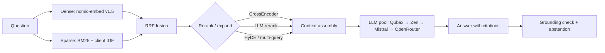

# Production RAG — Hybrid Retrieval + Citations

Демо RAG-пайплайна с **измеряемым** качеством: гибридный поиск (dense + sparse, RRF),
реранкинг, цитаты и честный отказ. Векторный индекс живёт в Qdrant Cloud, приложение —
тонкое (Streamlit + FastEmbed), запускается локально, в Docker или через публичный туннель.

## Быстрый старт

```powershell
# 1) локально
pip install -r requirements.txt
Copy-Item .env.example .env      # заполнить ключи Qdrant/LLM
streamlit run app.py

# 2) публичная ссылка (бесплатно, без аккаунта)
D:\AI\opencode-work\deploy-rag\tools\start-rag-public.cmd   # печатает trycloudflare.com URL

# 3) Docker
docker build -t production-rag .
docker run -p 7860:7860 --env-file .env production-rag
```

## Архитектура



## Слои

| Слой | Реализация |
|---|---|
| Векторное хранилище | Qdrant Cloud, `rag_v2_q_test` — 310 746 чанков MS MARCO |
| Dense | `nomic-ai/nomic-embed-text-v1.5` (768d, COSINE, INT8) через FastEmbed |
| Sparse | `Qdrant/bm25` + клиентский BM25 IDF (`eval/idf_stats.json`) |
| Fusion | Reciprocal Rank Fusion (server-side), либо weighted RRF |
| Rerank | `Xenova/ms-marco-MiniLM-L-6-v2` (ONNX, без PyTorch) или LLM-rerank |
| Генерация | LLM-пул (Qubax → Zen → Mistral → OpenRouter) с промптом на цитаты `[n](msmarco#id)` |
| Guardrails | санитизация контекста (prompt-injection) + дельмитеры `<<<CONTEXT>>>` |
| UI | Streamlit (стриминг, trace, A/B, cost, feedback) |

## Стратегии retrieval (11)

`hybrid` (дефолт) · `hybrid_diverse` (MMR) · `hybrid_cross_encoder` · `hybrid_hyde` ·
`hybrid_hyde_cross_encoder` · `multi_query` (LLM-перефразы) · `dense_only` · `sparse_only` ·
`hybrid_weighted` · `hybrid_llm_rerank` · `dense_hyde`.

## Метрики retrieval (100 вопросов MS MARCO, qrels train.tsv)

| Стратегия | Hit@5 | Hit@10 | MRR@10 | NDCG@10 | avg s |
|---|---|---|---|---|---|
| **hybrid + CrossEncoder** | **0.86** | **0.94** | **0.66** | **0.729** | 3.7 |
| hybrid + HyDE + CrossEncoder | 0.85 | 0.93 | 0.63 | 0.703 | 3.66 |
| hybrid + HyDE | 0.81 | 0.88 | 0.53 | 0.616 | 2.7 |
| dense only (nomic v1.5) | 0.80 | 0.90 | 0.54 | 0.623 | 0.27 |
| dense + HyDE | 0.78 | 0.90 | 0.56 | 0.639 | 3.1 |
| hybrid (RRF + IDF) | 0.75 | 0.87 | 0.50 | 0.587 | 0.19 |
| hybrid + MMR diversity | 0.69 | 0.80 | 0.47 | 0.549 | 0.20 |
| multi-query (LLM rewrites) | 0.80 | 0.87 | 0.58 | 0.654 | 2.94 |
| sparse only (BM25 + IDF) | 0.54 | 0.69 | 0.36 | 0.435 | 0.16 |

Источник — `eval/results_retrieval.json` (вкладка «Retrieval benchmarks» в UI).
Ground truth = релевантный `doc_id` присутствует в индексе; документы дедуплицируются по `doc_id`.

На одних и тех же 30 вопросах: `hybrid` NDCG@10 0.615, **`hybrid_ce` 0.728**, `multi_query` 0.606.
Основной прирост даёт CrossEncoder; HyDE и multi-query на этом корпусе **не помогают** и только
добавляют latency — измерение показало, что «сложные» стратегии здесь не оправданы.

Качество **генерации** (LLM-судья: faithfulness / answer relevancy / валидность цитат) —
`eval/eval_generation.py` → `eval/results_generation.json` (вкладка «Generation benchmarks»).
Прогон на 30 вопросах: faithfulness **0.965**, answer relevancy **0.917**, валидность цитат **1.000**
(расширяется `--limit N`).

## Стоимость и латентность

| Компонент | Стоимость |
|---|---|
| Embeddings / retrieval / rerank | **$0** (всё локально, FastEmbed) |
| Генерация (Qubax qwen3-235b) | ~$0.00002–0.00003 за запрос |
| Хостинг (локально + Cloudflare tunnel) | **$0** |
| Qdrant Cloud | free tier |

## Оценка (reproducible)

```powershell
python eval/eval_retrieval.py  --strategies hybrid,hybrid_ce,hybrid_hyde   # retrieval
python eval/eval_generation.py --strategy hybrid --limit 30                # generation
python eval/smoke_app.py                                                   # UI/регресс-смок
```

## Деплой

| Хост | RAM | Статус |
|---|---|---|
| Docker (VPS / Oracle Always Free / локально) | 2–24 GB | работает всегда, максимальный контроль |
| Google Cloud Run | до 8 GB | free tier, scale-to-zero, нужен GCP-проект |
| Streamlit Community Cloud | ~2.7 GB | бесплатно; билд из `requirements.txt` (`.python-version` = 3.12) |
| Hugging Face Spaces (Docker SDK) | 16 GB | **нужен PRO** — с 2026 бесплатны только Static Spaces |

Кэш моделей FastEmbed — `FASTEMBED_CACHE_PATH` (по умолчанию `D:\AI\opencode-work\fastembed_cache`),
чтобы не перекачивать ~600 МБ и не хранить на C:.

## Limitations & Next steps

- **Mojibake в корпусе** (`Colorâ€"` вместо `Color—`): чиним **на чтении** (`_fix_mojibake`),
  полноценно лечится только переиндексацией (отложено, требует согласия). Источник — битая
  кодировка при индексации MS MARCO.
- **Покрытие корпуса**: проиндексировано 310 746 чанков (подмножество 8.84M строк MS MARCO).
- **Score-порог отказа** задаётся вручную (разные шкалы у RRF/CE/cosine).
- **Router** (авто-выбор стратегии по типу вопроса) — не реализован.
- Дальше: multi-query в UI по умолчанию, RAGAS как второй судья, semantic cache.

## Файлы

```
app.py                          Streamlit UI (стриминг, trace, A/B, cost, feedback)
scripts/common.py               LLM-пул + FastEmbed-обёртки
scripts/module_5_retrieval.py   Qdrant hybrid search, HyDE, multi-query, rerank, mojibake-fix
scripts/module_7_generation.py  цитаты, стриминг, grounding, санитизация контекста
eval/eval_retrieval.py          метрики retrieval (Hit/MRR/NDCG)
eval/eval_generation.py         метрики генерации (LLM-судья)
eval/smoke_app.py               регресс-смок UI
tools/                          локальный публичный запуск (start-rag-public.cmd + cloudflared)
Dockerfile                      детерминированный контейнер
```
